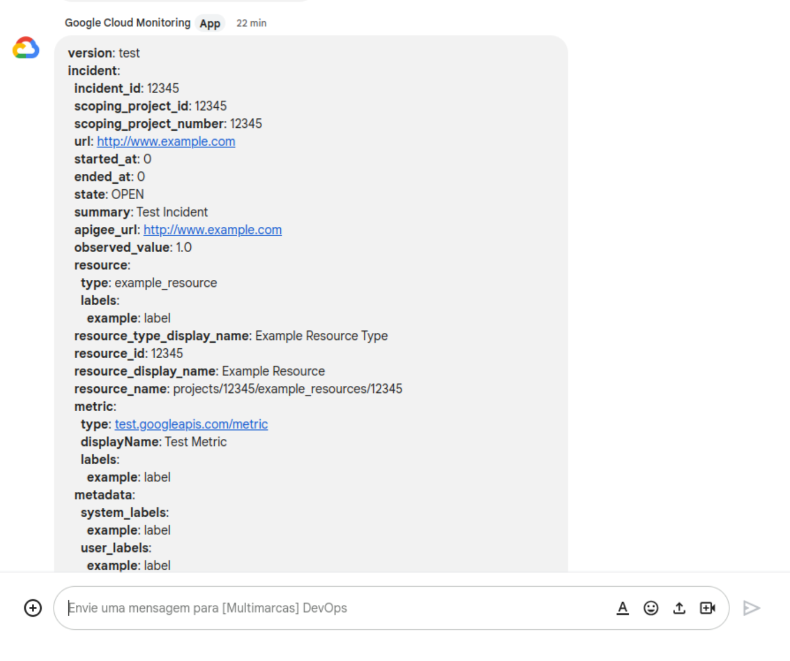

# forward-gcp-monitor-to-google-chats
This is a simple Cloud Functions that read the JSON payload evento from the Google Cloud Error Reporting (Notification Channels) and redirects as YAML to Google Chats

# After the Cloud Functions Deploy

- Copy the Cloud Functions URL
- Create a webhook url for the given Space (group)
- Encode the url https://www.urlencoder.org/
- The full URL you will use in the notification should look like: `https://{region}-{project-id}.cloudfunctions.net/{your-cloud-function-name}/?chat_webhook_url={encoded-url-from-previous-step}
- Go to https://console.cloud.google.com/monitoring/alerting/notifications and create the webhook using the url above
- Go to https://console.cloud.google.com/errors
- At the top-right corner click on "Configure Notification" and select the webhook you created i the Notification Channels

If everything goes well, the notifications forwarded will look like this:

